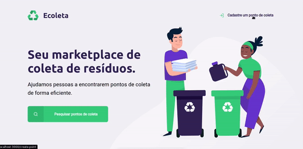
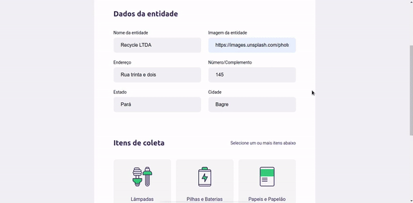

# #NextLevelWeek - Ecoleta🚀

#####👾 Projeto feito através da primeira edição da #NextLevelWeek

### Sobre o projeto:
Realizada durante a semana do meio ambiente, esta plataforma tem como objetivo ajudar pessoas a encontrarem pontos de coletas mais próximos onde a mesma poderá fazer o descarte adequado dependendo do tipo de resíduo!

### Principais tecnologias usadas:
* [Node.js](http://github.com)
* [Sqlite3](https://sqlite.org/index.html)
* [Express](https://expressjs.com/)
* [Nunjucks](https://mozilla.github.io/nunjucks/)

#### Obs:
Na raiz do projeto, execute o "npm" para instalar as dependências...